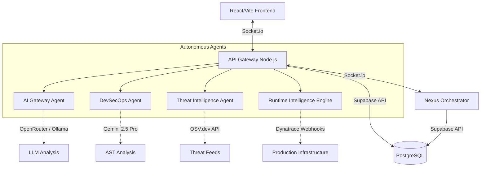

# CyberMesh Architecture

CyberMesh is an autonomous AI-native security operations mesh that coordinates specialized AI agents to protect prompts, repositories, deployments, and live runtime infrastructure in realtime.

## Core Architectural Philosophy

CyberMesh abandons the traditional "static dashboard" model in favor of a **real-time, event-driven intelligence mesh**. The system relies on decentralized AI agents that independently evaluate specific vectors (Prompts, Code, Dependencies, Runtime) and broadcast their findings via WebSockets. An autonomous orchestration engine (the Nexus Orchestrator) ingests this telemetry and executes automated remediation actions, such as blocking deployments.

## High-Level System Topology



## Agent Responsibilities

### 1. AI Gateway Agent
- **Function:** Real-time semantic firewall for GenAI prompts.
- **Tech:** Express endpoint, OpenRouter (Gemini Flash Lite), Ollama (Gemma 2) fallback.
- **Role:** Intercepts prompt injections, jailbreaks, and malicious payloads before they reach the core LLM processing layers.

### 2. DevSecOps Agent
- **Function:** Semantic code reasoning and repository scanning.
- **Tech:** GitHub API integration, Google Generative AI SDK (Gemini 1.5 Pro).
- **Role:** Parses Abstract Syntax Trees (AST) and dependency graphs of live GitHub repositories. Identifies logical flaws (e.g., JWT vulnerabilities, SQLi) and extracts dependency manifests for the Threat Intelligence Agent.

### 3. Threat Intelligence Agent
- **Function:** Live Zero-Day and CVE monitoring.
- **Tech:** OSV.dev (Open Source Vulnerabilities) API, Supabase.
- **Role:** Receives dependency manifests directly from the DevSecOps Agent. Cross-references versions against the Google OSV database in real-time. Upserts identified threats to Supabase to prevent duplication and broadcasts active CVE alerts to the mesh.

### 4. Runtime Intelligence Engine
- **Function:** Production infrastructure observability.
- **Tech:** Dynatrace Webhook Integration.
- **Role:** Correlates live Dynatrace observability telemetry with vulnerabilities and deployment risks to autonomously detect operational threats in production systems. Maps production issues to potential active exploits.

### 5. Nexus Orchestrator
- **Function:** The autonomous orchestration engine.
- **Tech:** Detached Node.js Microservice, Socket.io, Supabase.
- **Role:** Maintains the global composite security score. Subscribes to the `cybermesh-orchestration` channel. If the global risk threshold is breached (e.g., active CVE combined with a runtime latency spike), it autonomously drops the guillotine and blocks pending deployments in the CI/CD pipeline.

## Data Persistence & Real-Time Events

CyberMesh utilizes **Supabase (PostgreSQL)** for robust, lightweight data persistence and real-time state management.

- **Direct Supabase JS Client:** Eliminates heavy ORM layers (like Prisma) for maximum hackathon speed and minimal compilation overhead.
- **Upsert Logic:** The Threat Intelligence Agent relies on SQL `ON CONFLICT (cve)` constraints to silently update threat feeds without duplication errors.
- **WebSockets (Socket.io):** Used for instantaneous agent-to-agent and agent-to-UI communication, ensuring the frontend visualization (Deployment Center, Autonomous Map) reacts instantaneously to AI discoveries.

## Supabase SQL Initialization

Run the following inside the Supabase SQL Editor to set up the mesh:

```sql
-- 1. Central Logging for the Nexus Orchestrator
CREATE TABLE agent_events (
  id UUID DEFAULT gen_random_uuid() PRIMARY KEY,
  type TEXT NOT NULL,
  agent TEXT NOT NULL,
  message TEXT NOT NULL,
  timestamp TIMESTAMPTZ DEFAULT timezone('utc'::text, now()) NOT NULL
);

-- 2. Threat Intelligence Feed
CREATE TABLE threats (
  id UUID DEFAULT gen_random_uuid() PRIMARY KEY,
  cve TEXT UNIQUE NOT NULL,
  severity TEXT NOT NULL,
  title TEXT NOT NULL,
  affected_package TEXT,
  published_date TIMESTAMPTZ NOT NULL,
  cvss NUMERIC,
  created_at TIMESTAMPTZ DEFAULT timezone('utc'::text, now()) NOT NULL
);

-- 3. Deployment Center Pipelines
CREATE TABLE deployments (
  id UUID DEFAULT gen_random_uuid() PRIMARY KEY,
  name TEXT NOT NULL,
  branch TEXT NOT NULL,
  status TEXT NOT NULL,
  score INTEGER NOT NULL,
  timestamp TIMESTAMPTZ DEFAULT timezone('utc'::text, now()) NOT NULL
);

CREATE TABLE deployment_checks (
  id UUID DEFAULT gen_random_uuid() PRIMARY KEY,
  deployment_id UUID REFERENCES deployments(id) ON DELETE CASCADE NOT NULL,
  name TEXT NOT NULL,
  status TEXT NOT NULL,
  message TEXT NOT NULL,
  agent TEXT NOT NULL
);

-- Enable RLS on all tables
ALTER TABLE agent_events ENABLE ROW LEVEL SECURITY;
ALTER TABLE threats ENABLE ROW LEVEL SECURITY;
ALTER TABLE deployments ENABLE ROW LEVEL SECURITY;
ALTER TABLE deployment_checks ENABLE ROW LEVEL SECURITY;

-- Allow public read access (so the frontend ANON_KEY can fetch the data)
CREATE POLICY "Allow public read access on agent_events" ON agent_events FOR SELECT USING (true);
CREATE POLICY "Allow public read access on threats" ON threats FOR SELECT USING (true);
CREATE POLICY "Allow public read access on deployments" ON deployments FOR SELECT USING (true);
CREATE POLICY "Allow public read access on deployment_checks" ON deployment_checks FOR SELECT USING (true);
```
