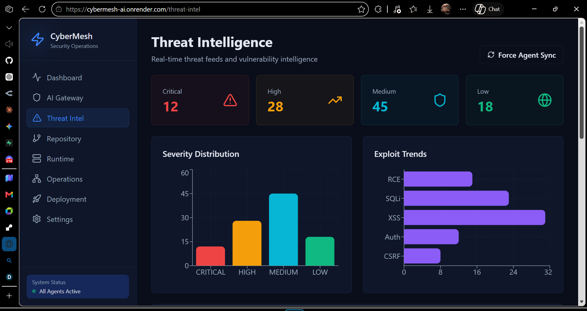
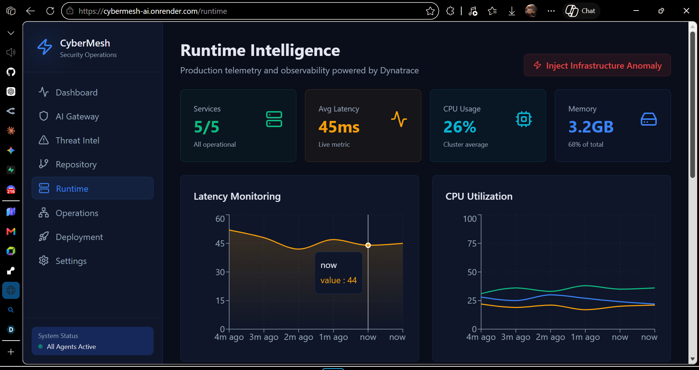
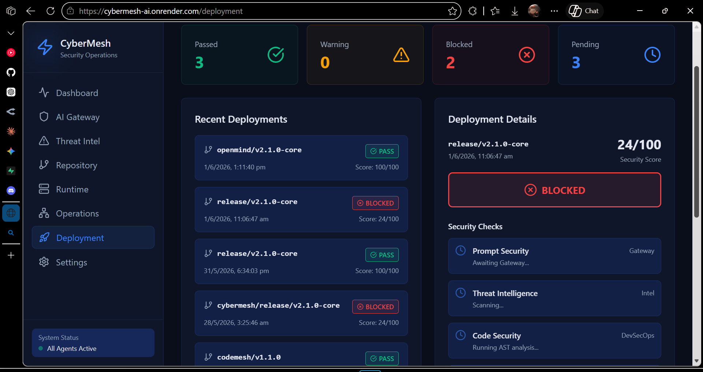

# CyberMesh 🌐

> **From Prompt to Production — Secure Everything.**

CyberMesh is an autonomous AI-native security operations mesh that coordinates specialized AI agents to protect prompts, repositories, deployments, and live runtime infrastructure in realtime.


Built for the **Google Cloud Rapid Agent Hackathon**.

## Built With

- Gemini 1.5 Pro
- Google Cloud Agent Builder
- Dynatrace MCP
- Supabase Realtime
- React Flow
- Socket.io

## The Unforgettable Moment (Live Demo Flow)

The power of CyberMesh is best demonstrated in this single, continuous, real-time sequence:

1. **Prompt attack detected** (Gateway Agent)
2. **↓ Threat feed activates** (Intel Agent cross-referencing OSV.dev)
3. **↓ Runtime anomaly spikes** (Dynatrace telemetry ingestion)
4. **↓ Agent graph glows red** (Autonomous operations map)
5. **↓ Deployment instantly BLOCKED** (Nexus Orchestrator executes)
6. **↓ AI remediation appears** (DevSecOps mitigation strategy)

*This sequence operates entirely autonomously without manual intervention.*

## Screenshots

> *(Placeholders for Hackathon Presentation)*

### Autonomous Orchestration Map

*Live visual graph of the decentralized intelligence mesh coordinating risk events.*

### Runtime Intelligence Graph

*Real-time Dynatrace telemetry mapped directly to active infrastructure vulnerabilities.*

### Deployment Center Block Action

*The Nexus Orchestrator autonomously dropping the guillotine on a vulnerable CI/CD pipeline.*

## Why CyberMesh?

Traditional security platforms operate in silos.

CyberMesh creates a realtime autonomous intelligence mesh where AI agents continuously collaborate across:
- prompt security
- DevSecOps
- threat intelligence
- runtime observability
- deployment systems

to autonomously correlate risks, reason about operational impact, and prevent unsafe production releases before damage occurs.

## Features

- 🛡️ **AI Gateway Agent:** Real-time semantic firewall protecting LLMs against prompt injections and jailbreaks using OpenRouter (Gemini Flash) with local Ollama fallback.
- 🔬 **DevSecOps Agent:** Autonomous repository scanning. Feeds live GitHub source code and package manifests to **Gemini 1.5 Pro** for deep semantic vulnerability analysis.
- 🚨 **Threat Intelligence Agent:** Live Zero-Day threat tracking. Cross-references dependencies found by the DevSecOps Agent against the **OSV.dev** (Open Source Vulnerabilities) API.
- 📡 **Runtime Intelligence Engine:** Correlates live Dynatrace observability telemetry with vulnerabilities and deployment risks to autonomously detect operational threats in production systems.
- 🧠 **Nexus Orchestrator:** The autonomous orchestration engine. Aggregates telemetry from all agents to compute a global risk score, automatically blocking CI/CD pipelines in the **Deployment Center** if critical thresholds are breached.

## Autonomous Orchestration Flow

CyberMesh continuously coordinates multiple AI agents through a realtime event mesh:

1. Gateway Agent detects prompt injection attempts
2. DevSecOps Agent identifies vulnerable dependencies
3. Threat Intelligence Agent correlates active exploit campaigns
4. Runtime Agent detects production anomalies via Dynatrace
5. Nexus Orchestrator computes composite operational risk
6. Deployment Engine automatically blocks unsafe releases
7. AI remediation workflow generates actionable fixes

## Architectural Principles

CyberMesh is built around:
- event-driven orchestration
- decentralized agent reasoning
- realtime telemetry streaming
- autonomous operational intelligence
- observability-first security workflows
- deployment-aware risk correlation

## Tech Stack

### Frontend
- React 18 / Vite
- TypeScript
- Tailwind CSS
- Framer Motion (Cinematic Animations)
- Recharts (Live Telemetry)
- React Flow (Interactive Orchestration Map)

### Backend & Infrastructure
- Node.js / Express
- Socket.io (Real-time Event Mesh)
- **Supabase (PostgreSQL)** (Database and Event Persistence)
- @google/generative-ai SDK (Gemini 1.5 Pro)

## Getting Started

### Prerequisites

1. Node.js (v18+)
2. pnpm (Workspace Manager)
3. API Keys:
   - Google Gemini API Key
   - OpenRouter API Key
   - Supabase URL & Service Role Key
4. (Optional) Ollama running locally for AI fallback testing.

### Installation

1. **Clone the repository and install dependencies:**
   ```bash
   pnpm install
   ```

2. **Environment Variables:**
   Create a `.env` file in `apps/backend/` and add your keys:
   ```env
   PORT=3001
   GEMINI_API_KEY=your_gemini_key
   OPENROUTER_API_KEY=your_openrouter_key
   OLLAMA_API_URL=http://localhost:11434
   SUPABASE_URL=your_supabase_project_url
   SUPABASE_SERVICE_ROLE_KEY=your_supabase_service_role_key
   ```
   Create a `.env` file in the project root for Vite variables:
   ```env
   VITE_SUPABASE_URL=your_supabase_project_url
   VITE_SUPABASE_ANON_KEY=your_supabase_anon_key
   ```

3. **Database Setup:**
   Run the provided SQL script located in `ARCHITECTURE.md` (or the Supabase setup instructions) in your Supabase Dashboard SQL Editor to initialize the required tables and configure Row Level Security (RLS).

### Running the Application

CyberMesh relies on three concurrently running services:

1. **Start the API Gateway (Backend):**
   ```bash
   cd apps/backend
   npm run dev
   ```

2. **Start the Nexus Orchestrator:**
   ```bash
   cd services/nexus-orchestrator
   npm run dev
   ```

3. **Start the Frontend UI:**
   ```bash
   npm run dev
   ```

## The Demo Playbook

To demonstrate the full power of CyberMesh during a pitch:

1. **Initiate Deployment:** Go to the Deployment Center and click "Initiate Production Release". Watch it enter a pending state.
2. **Scan Repository:** Go to Repository Security, paste a vulnerable GitHub URL (e.g., one containing `jsonwebtoken`), and click Scan. Watch Gemini 1.5 Pro parse the AST live.
3. **Intel Handoff:** Watch as the DevSecOps agent silently passes the discovered dependencies to the Threat Intelligence Agent, which queries OSV.dev and populates the Threat Intelligence feed with live CVEs.
4. **The Block:** Watch the Autonomous Operations map glow red. The Nexus Orchestrator will calculate the critical risk and instantly snap your pending deployment into a **BLOCKED** state.

## Realtime Infrastructure

CyberMesh uses:
- Socket.io for low-latency event propagation
- Supabase Realtime for synchronized UI updates
- event-driven orchestration for autonomous agent communication
- streaming telemetry pipelines for operational intelligence

## Monorepo Structure

```text
/apps
  /backend             # API Gateway & Agent Route Controllers

/services
  /nexus-orchestrator  # Detached autonomous decision engine

/src                   # React + Vite Frontend Application
  /app
    /pages             # UI Dashboards (Deployment, Maps, etc.)
    /services          # Socket.io & Supabase Clients

/shared                # Shared Workspace Dependencies
  /types               # Common TypeScript definitions
  /events              # Standardized WebSocket payload definitions
```

## Architecture

### System Topology Preview


For a deep dive into the decentralized agent mesh and Supabase integration, see [ARCHITECTURE.md](./ARCHITECTURE.md).

---

CyberMesh demonstrates how autonomous AI agents, realtime observability, and operational security intelligence can converge into a unified self-defending infrastructure platform.

